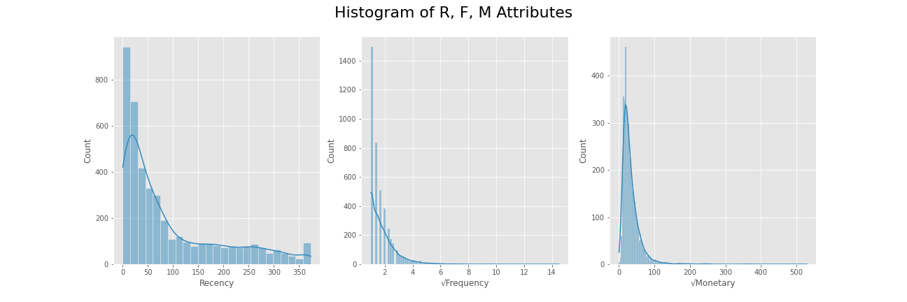
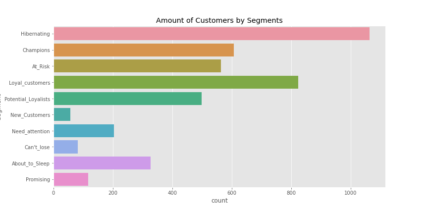
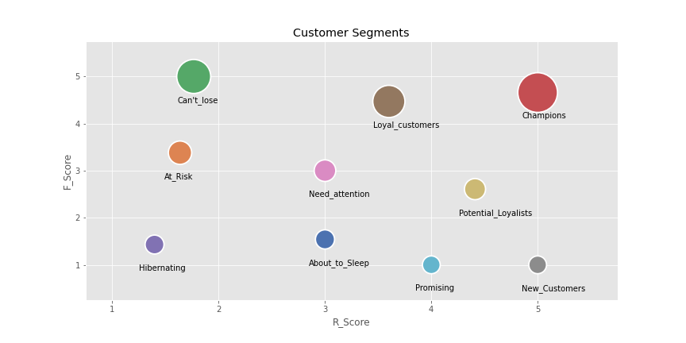

# Customer Segmentation using RFM Analysis
## Overview
Customer segmentation is simply dividing the target market into smaller groups that have similar attributes or characteristics. This gives a business more ammunition to know clients at a more intimate level, thus able to offer much-needed competitive advantage in exploring new markets and products. 

It is also a given that Customer Experience will most likely improve because the understanding of customer needs and preferences affords you a better chance of serving clients better in comparison to an entity that is clueless about their client’s attributes. 

But how can we use a data-driven approach to do the customer segmentation for a business? This workbook will illustrate the **RFM analysis** for customer segmentation on online retail data to help you better understand everything beneath. 

  

## What is RFM Analysis?
RFM analysis is a marketing technique used to quantitatively rank and group customers based on the **Recency**, **Frequency** and **Monetary** total of their recent transactions to identify the best customers and perform targeted marketing campaign. Each of these metrics represents customer trait.

- **Recency**: The time been since customer's last purchase
- **Frequency**: The total number of orders placed by the same customer
- **Monetary**: The aggregated monetary volume of a client's historical purchase

With the above metrics defined, we can assign scores to the customers to represent their trait. As an example, a customer who purchased one day ago will recieve a Recency score of 5, while someone who's last order is from one year before woule be assigned a score of 1. Now, with transactional-level value converted to RFM scores, it increases the comparability across each class. Thus, we can use the combination of customers' R, F, M rankings to implement the segmentaions.

## Technology and Capabilities:
- Python
- Data Processing using Pandas library
- Data Visualization
- Customer Segemtation, Customer Strategy, Customer Value Proposition

In the following part, we will be seeing how exactly the RFM analysis are conducted based on transactional-level data.

## Table of Content
1. [Business Scenario](#case)
2. [Data Processing](#data_processing)
3. [RFM Metric Calculation](#metric)
4. [Customer Sgementation](#cs)
5. [Data Visualization and Analysis](#ana)
6. [Conclusion](#conclusion)

## Business Scenario 
Let's assume we are running a e-commerce company, and we would love to segment our customers. So that we can propose our pricing strategy for each group based on our findings on the customer segmentation.

In this case, we will be using a set of transactional-level data, to extract the features based on clients' order history and perform further analysis.

The data is available at: https://archive.ics.uci.edu/ml/datasets/Online+Retail+II

This Online Retail II data set contains all the transactions occurring for a UK-based and registered, non-store online retail between 01/12/2010 and 09/12/2011. The company mainly sells unique all-occasion gift-ware. Many customers of the company are wholesalers.

## Data Processing 
The data we have is a one-year records of transactions, with the following attributes:
- **InvoiceNo**: Invoice number
- **StockCode**: Product code
- **Description**: Product name
- **Quantity**: The quantities of each product per transaction
- **InvoiceDate**: Invoice date and time
- **UnitPrice**: Unit price
- **CustomerID**: Customer number
- **Country**: Country name

To process it into a useable format, we will need to follow the following steps:
- Remove records about cancelled orders
- Remove records that has no CustomerID
- Pivot the data at the level of Customer: 
  - Group by CustomerID
  - Find the latest purchase day (Recency) 
  - Total number of orders placed (Frequency) 
  - Total volume of purchase (Monetary)

Now, we will have all three features regarding R,F,M for each individual customers, and we are ready to convert these features to scores based on their rankings within each category.

## RFM Metric Calculation 
The plot below shows the histogram of the original RFM features, and we can see the frequency and monetary parts are quite dispersed. Therefore, calculating the R, F, M scores will increase the overall comparability.

  

By sorting the 3 R, F, M attributes in order, we can assign the score based on their ranking. As an example, for the top 20% of the customer that have the highest purchase amount, we can assign them a score of 5, the following 20% will receive 4 as their score and so forth.

After calculating the RFM scores for each customer, we will then be able to compare their purchasing behavior, implement the segmentation and design pricing/marketing strategy for each group of customers.

## Customer Segmentation 
By looking at their associated R,F,M scores, we can then classify them into different segments. Here are some examples of the segmentation:

- **Champions**: Those who place orders most recently, most frequently, and have tracked record of high volume in spending. Businesses can provide loyalty reward to this group. They can become early adopters for new products.
- **Potential Loyalists**: Recent customers with moderate frequency and amount of spending. Offer loyalty program or customized recommendation for them to upsell products and convert them into loyal members.
- **New Customers**: Customers who just purchase once recently. Design marketing strategy to increase their visits and retain this group.
- **At Risk**: Clients who has tracked records of orders and spending, but inactive recently. Offer customized reactivation campaigns to reconnect, and offer renewals to encourage purchase.

## Data Visualization and Analysis 

  

First, let's take a look at the amount of customers within each segements. The amount of clients within the class **Hibernating** dominates. Since the company is an e-commerce retailer who sell seasonal souvenirs, this group are those who purchase mostly during holidays. On the other hand, we have also seen a big portions in the following groups: **Champions**, **Loyal Customers** and **Potential Loyalists**. A big part of them might be wholesalers who has more demands than individual buyers.

  

If we look at the above plot, where the size of each pie idicates the average spending within each segments, we can be more confident that most of the customers in **Champions**, **Loyal Customers** and **Potential Loyalists** groups are wholesalers, as the volume of spending are much higher than the remaining classes. For this group of clients, we can try to build long-term collaboration with them by agreeing on special offers that leads to "Win-Win" for both parties. Besides, we can also see a great spending amount from the **Can't Lose** group, though they may not purchase as often as others do, they spend a lot each time they place an order, therefore, it is worth building relationship with this group retain their seasonal purchases.

## Conclusion 
Customer segemtation grants business the lens to analyse its customer base more comprehensively. With a better understanding of the composition of the business's customer, stakeholders can make more precise decisions on designing different marketing campaigns to target different groups of customers.
